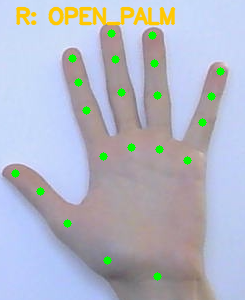
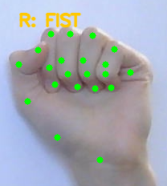
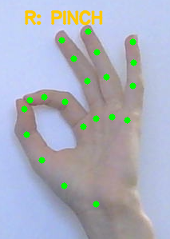
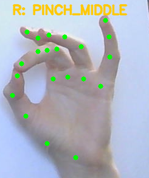
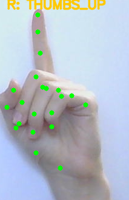

# GCPC

GCPC — приложение для управления ПК жестами рук через камеру (Windows, Python + MediaPipe + OpenCV + PySide6).

## Что умеет сейчас

- Панель управления при старте:
  - `Hand control: ON/OFF`
  - `Camera: ON/OFF`
  - выбор разрешения камеры в dropdown
  - кнопка `Gesture settings`
- Окно настроек жестов:
  - соответствия `gesture -> hotkey` (single и sequence)
  - запуск калибровки кнопкой `Run calibration now`
  - настройка размера mouse-области
  - чекбокс `Display only hands windows` (режим "только руки")
- Логи и friendly-error обработка:
  - лог-файл `logs/gcpc.log`
  - всплывающее окно при критической ошибке
- Сборка в один `exe` (+ `config.json` + модель для tasks backend)

## Быстрый старт (из исходников)

```powershell
pip install -r requirements.txt
python -m app.main
```

## Управление в рантайме

1. Запустите приложение.
2. В панели включите `Camera`.
3. Включите `Hand control`.
4. Откройте `Gesture settings`, если нужно поменять биндинги.


## Сборка EXE (onefile)

См. подробности в [BUILD.md](GCPC/BUILD.md).

Коротко:

```powershell
powershell -ExecutionPolicy Bypass -File .\build.ps1 -InstallMissingDeps
```

Или с явным Python:

```powershell
powershell -ExecutionPolicy Bypass -File .\build.ps1 -PythonExe "C:\Users\Artyom\AppData\Local\Programs\Python\Python312\python.exe" -InstallMissingDeps
```

После сборки:

- `release\GCPC.exe`
- `release\config.json`
- `release\logs\gcpc.log`
- `release\models\hand_landmarker.task`

## Галерея жестов


## Галерея жестов

| OPEN_PALM | FIST | PINCH |
|---|---|---|
|  |  |  |

| PINCH_MIDDLE | THUMBS_UP | SWIPE_LEFT / SWIPE_RIGHT |
|---|---|---|
|  |  | IN_PROGRESS


## Где смотреть логи

- `GCPC/logs/gcpc.log` (при запуске из исходников)
- `GCPC/release/logs/gcpc.log` (после сборки `exe`)


